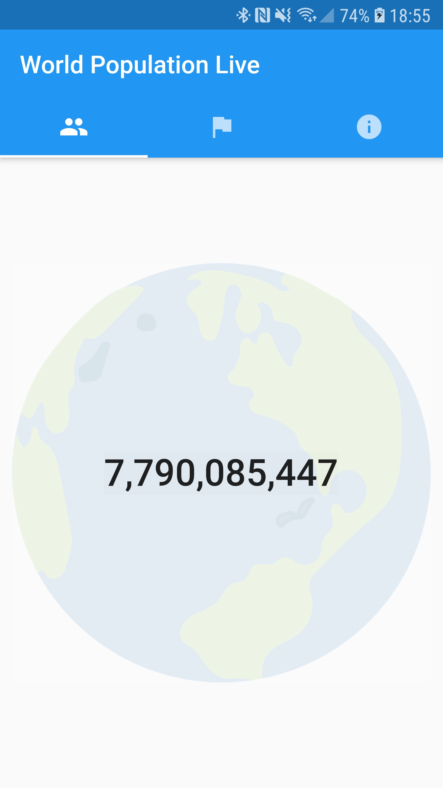

# World Population Counter Live

This app is a simple test of Flutter cross-platform framework from Google: [flutter.dev](https://flutter.dev).

The current population is estimated for the whole world and for each country based on the U.N predictions: [datas available here](https://population.un.org/wpp/Download/Standard/Population/).

Country flags are retrieved from the [country_icons](https://pub.dev/packages/country_icons) package.

Feel free to suggest changes or contribute.

